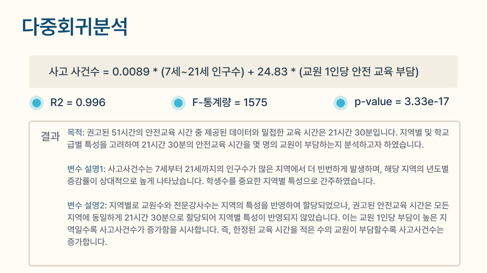

# [제2회 학교안전사고 데이터 분석 및 활용 경진대회](https://www.xn--289axkt9l0mao04fs9c7wrl7hfxc.com/)
## 🏫모두가 안전한 학교 : 현황 분석과 안전 교육 개선🏫
### 데이터 분석 목적
- 2021년 대비, 2023년에 학교 안전사고 발생 건수가 약 199% 증가했고
- 2021년 대비 2022년에 학생들의 응급실 내원 건수가 약 159% 증가했다

  ➡️ 학교안전사고 현황을 파악하여 효과적인 예방을 위한 대책 마련 필요하다고 판단 !

### 다중회귀분석
- 지역 별 안전사고건수와 학생 수가 다른 반면 전국적으로 51시간의 안전 교육 시간은 전국적으로 동일한 것을 확인했다
- **교원 1인당 안전교육 부담이 사고 건수가 많은 지역이 적은 지역에 비해 더 많을 것** 이라 가설을 세운 뒤 분석 실시했다

- 7세에서 21세의 학생수와 사고건수의 강한 상관관계가 있었다
- 또한, 교원 1인당 안전교육 부담이 클수록 사고 건수가 증가한다는 유의미한 결과를 얻었다

### 활용 방안
분석 결과에 따라 두 가지 주요 해결 방안을 제시한다.

**1️⃣ 안전 교육 개선**
안전 교육을 양적 혹은 질적으로 개선시키는 2가지 방향 제안한다.
- 교육 시간 증가시키기(양적)

   지역별 사고 건수는 서울과 경기가 전체 사고 건수의 80%를 차지하고 있었고 여학생보다 남학생이 2배 이상 더 많은 사고가 발생했다.
    따라서, 서울, 경기지역 및 남학생이 밀집되어 있는 학교에 교육 시간 증가시킨다.
- 맞춤형 안전 교육 실시(질적)

  각 학교급 별로 많이 다치는 부위가 상이하기 때문에 학교급별 특성에 맞춘 맞춤형 안전 교육 자료를 개발하여 교육을 실시한다.

**2️⃣ 추가 인력 배치**

  사고 발생 시간대별 빈도 그래프 시각화 결과, 모든 학교급에서 오전 시간대에 사고가 많이 발생했다. 이를 예방하기 위해, 오전 시간대에 추가 교사를 배정하도록 한다. 추가 교사는 **교육대학교, 사범대학교, 체육대학교 학생들로 구성하여 봉사 시간을 부여하거나 실습 시간을 인정하는 방식**으로 배치하여 미래의 교사에게 사고 예방 교육의 중요성을 체득할 수 있는 기회를 제공한다.

### 대시보드
아래와 같이 총 3가지 대시보드를 제작했다. 

https://github.com/user-attachments/assets/0b52b19d-4f29-48f8-9682-932fdd1a54c4

### 공모전 포스터

